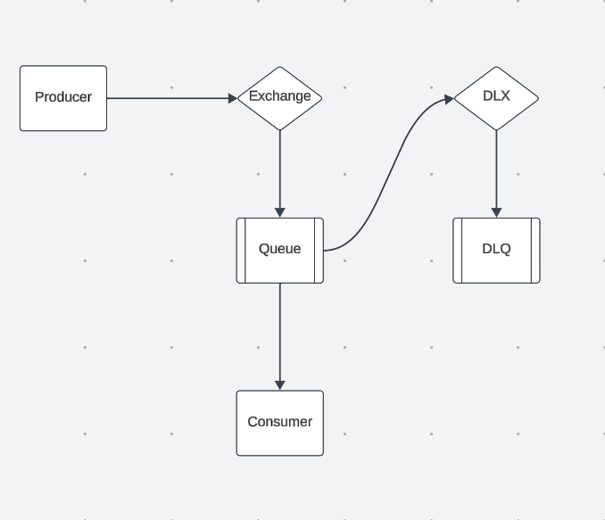

# Consumidor de fila com RabbitMQ

## Entendo RabbitMQ e sua importancia

Em sistemas distribuídos, o processamento assíncrono é frequentemente necessário para desacoplar tarefas e garantir que o fluxo principal não seja interrompido. Uma das abordagens mais eficazes para isso é o uso de sistemas de mensageria. Nesse contexto, é possível enviar mensagens para filas, onde elas ficam armazenadas até serem processadas posteriormente.

Este projeto utiliza o RabbitMQ, um dos serviços de mensageria mais populares. Além de implementar o conceito de filas, o RabbitMQ introduz o conceito de exchanges. Uma exchange atua como intermediária, recebendo mensagens enviadas pelos produtores e encaminhando-as para as filas apropriadas. Essa abordagem permite uma distribuição de mensagens mais dinâmica e direcionada.

As filas armazenam as mensagens até que os consumidores as processem. Os consumidores, por sua vez, recuperam essas mensagens e realizam as operações necessárias. Essa arquitetura garante maior flexibilidade, escalabilidade e eficiência em sistemas distribuídos.

## Arquitetura de dead letter queue

Em sistemas de mensageria, erros no processamento de mensagens podem ocorrer por diversos motivos, como timeout, mensagens inválidas ou falhas no serviço durante o processamento. Para tornar a arquitetura de mensageria mais resiliente a falhas, recomenda-se a implementação do conceito de Dead Letter Queue (DLQ). Esse conceito consiste na criação de uma fila especial que armazena mensagens descartadas pela fila principal, permitindo tanto a investigação dos erros quanto o reprocessamento e a recuperação das mensagens com falhas.

No caso do RabbitMQ, essa arquitetura pode ser implementada da seguinte forma:

Na arquitetura acima, a exchange principal direciona as mensagens para uma fila consumida por um consumidor. Caso o consumidor não retorne um sinal de acknowledgment (confirmação de processamento) ou envie um sinal negativo, a mensagem é considerada falha. Nesse cenário, ela é redirecionada para uma Dead Letter Exchange (DLX), que, por sua vez, encaminha a mensagem para a DLQ.

Essa abordagem permite isolar mensagens problemáticas, mantendo a operação da fila principal e facilitando a análise de falhas, garantindo maior robustez e confiabilidade ao sistema.

